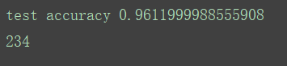
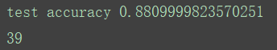
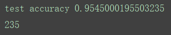
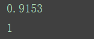

## PCA项目说明

#### 作者：1551719  张文喆

### 背景介绍
我在学习使用Google开发的深度学习框架Tensorflow时遇到了一个问题：入门教程中构建了一个卷积神经网络（CNN），训练并使用这个卷积神经网络识别手写数字（mnist数据库）。原版要求迭代20000次，并指出最终的预测准确度可以达到99.2%。但是我在实践中发现，对于我所使用的这台笔记本，很难达到这样高的迭代次数。最终，我将迭代次数降至1000次，并得到了96.1%的准确度，而且耗时将近4分钟。那么，我预计迭代20000次用时可能会超过1小时。  
于是，在这样的前提下，我萌生了对mnist中的数据进行降维的想法。mnist中的手写数字图片为28x28的灰度图，一维展开后即一个大小为784的向量。我准备将这个向量的大小降至100（10x10）

### 使用的工具
sklearn模块中的PCA方法

### 实现方法
我在Google提供的数据载入的代码input_data.py中插入了降维的函数，并且在具体使用的过程中，通过使用者不同的命令，既可以返回降维后的数据，也可以提供原始的数据。
```python
from sklearn.decomposition import PCA
pca = PCA(n_components=100)
usePCA = False
...
def images(self):
    if usePCA == True:
      newImages = pca.transform(self._images)
      return newImages
    else:
      return self._images
...
def learnPCA(self):
    self._images = pca.fit_transform(self._images)
    usePCA = True
```
在input_data.py中，训练数据和测试数据都被读入并放在两个DataSet类中，所以我将PCA的模型在类外进行声明，使用训练数据进行训练，并将训练数据转化为降维后的数据，之后再将测试数据用相同的PCA模型进行降维。使用同一个PCA模型非常重要，这里的梯度下降方法为小批量随机梯度下降，我之前错误地在每一次生成小批量数据时，都使用一个全新的PCA模型进行降维，并且最后的测试数据也使用了全新的PCA模型进行降维。在这种情况下，识别效果非常差，准确率不足30%。  
最终，我了解到PCA作为一种处理方式，在处理时会尽量多地保留信息，所以在不同的数据（比如每一批mnist训练集的数据）都会采用不同的保留方式。换句话说，为了尽可能多地保留信息，这种做法破坏了每一批数据之间的关联性（或者说，公共特征），每次提取到的特征不同，自然无法形成高效的学习模型。  
由于预计使用降维后的数据进行学习迭代20000次大概需要10分钟，所以我还是没有完整执行20000次迭代查看最终结果。

### 存在的缺陷
进行降维时，由于不可避免地丢失了数据的一部分特征，所以在同等迭代次数的情况下，使用降维后的数据的识别准确率是远不如原始数据的。下面展示运行效果。图中第一行为在测试集上的识别准确率，第二行为消耗时间（单位：s）  
  
(图1，未使用降维的数据，迭代1000次)  
  
(图2，使用降维后的数据，迭代1000次)  
从上面两张图可以看到，降维后的运行速度虽然大大提升，但是识别准确率严重下滑。  
  
(图3，使用降维后的数据，迭代7000次)  
可以看出，在使用时间几乎相等的情况，PCA降维后的识别准确率还是略有不如原始状态下的识别准确率。  

最后，我还对不使用卷积神经网络的情况下的学习使用了PCA，即对softmax方法使用PCA。softmax是一种类似于逻辑回归的学习方法，只不过经过了许多优化。  
  
(图4，softmax使用原始数据进行学习，迭代1000次)  
  
(图5，softmax使用降维后的数据进行学习，迭代1000次)  
有些令人惊讶的是，使用降维后的数据学习的识别准确率甚至略高于不使用的，但我认为这只是因为在随机初始化权值时的偶然造成的。事实上我运行了很多次两种方法，它们得到的结果（识别准确率）相差寥寥无几，并且不存在一种方法一直比另一种高的情况。这大概是因为softmax方法并没有发掘出原始数据里面一些深层次的信息，以至于即使这些信息随着降维丢失了，也对结果没有什么影响。

### 改进方法
抛开PCA本身存在的导致特征丢失的缺点不谈，我认为还是有些方法能使使用降维后的数据识别准确率上升的。
- #### 或许将训练集和测试集一起用于PCA模型的训练会提高准确率
  我认为PCA提取数据特征时应当考虑到整个数据集，也就是包括训练集和测试集的所有数据，因为这样才能提取到最准确的主特征。
- #### 调整PCA的目标维度可能会有更好的结果
  一般而言，保留的原始信息越多，识别准确率越高。我在这里将784维的数据降低至100维，减少将近7/8，这完全是为了追求运行速度。事实上将纬度调整至225（15x15）或者400（20x20）可能会有更好的结果。最终我们还是要追求一种速度与准确率的平衡。

### 参考网址
[TensorFlow官方中文社区](http://www.tensorfly.cn/tfdoc/tutorials/mnist_pros.html)

### 使用2DPCA的设计想法  
注意到input_data.py的line 101处有注释和代码：
```python
# Convert shape from [num examples, rows, columns, depth]
# to [num examples, rows*columns] (assuming depth == 1)
assert images.shape[3] == 1
images = images.reshape(images.shape[0], images.shape[1] * images.shape[2])
```
这里将图片数据由[图片数目,行,列,深度]转化为[图片数目,行x列]。由于此处深度depth==1，故将其舍弃。那么在进行2DPCA时，将无需此转换。  
[在这里记录网页链接](http://blog.csdn.net/lifeng_math/article/details/50474740)